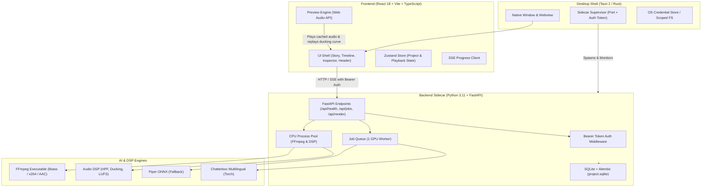

# StoryForge Studio — Architecture Specification

This document defines the high-level architecture, module boundaries, data contracts, and audio pipeline for StoryForge Studio.

---

## 1. System Overview

StoryForge Studio is built on a local-first desktop architecture combining a native desktop shell, a high-performance interactive frontend, and an authoritative Python backend sidecar.



---

## 2. Dual Audio Engine Contract

The core architectural contract separates interactive editing from master rendering while guaranteeing exact parity:

1. **Preview Engine (Frontend — Web Audio API)**:
   - Responsible for real-time, low-latency scrubbable playback (playback start < 300 ms).
   - Operates on decoded audio buffers or streaming audio element nodes.
   - Replays gain, pan, fades, and the **precomputed ducking gain curve**.
   - Does NOT recompute RMS ducking on the fly in JavaScript.

2. **Render Engine (Backend — Python + FFmpeg + numpy/soundfile)**:
   - Responsible for authoritative export generation (MP3, WAV, MP4, stems).
   - Computes RMS audio levels from narration tracks, determines envelope parameters (attack 80 ms, hold 250 ms, release 500 ms, duck -12 dB), and generates automation points.
   - Stores the resulting automation envelope in `project.sqlite` for frontend preview playback.

---

## 3. Project Storage Architecture

Projects are saved as a self-contained directory bundle with the `.storyforge` extension:

```
MyStory.storyforge/
├── project.json          # Project manifest (schema version, id, name, created, modified)
├── project.sqlite        # SQLite database (all structured metadata & relative file paths)
├── originals/            # Immutable imported user assets (audio, text, video)
├── generated/            # TTS chunks addressed by composite SHA-256 cache key
├── processed/            # Conditioned audio chunks (silence trimmed, DC removed, normalized)
├── renders/              # Scene/chapter intermediate mix renders
├── exports/              # Final user exports (MP3, WAV, MP4, SRT, VTT, Stems)
├── waveforms/            # Cached binary peak data for visual rendering
├── video/                # Video background assets
├── subtitles/            # Generated .ass, .srt, .vtt files
└── .recovery/            # Crash-recovery write-ahead journal
```

> **Invariant**: No binary audio data is stored directly in `project.sqlite`. The database only stores relative paths (e.g. `generated/abc123.flac`), making projects 100% portable between drives and machines.

---

## 4. Sidecar Lifecycle & Local Security

- **Port & Token Generation**: On startup, the backend binds to `127.0.0.1:0` (dynamic OS-assigned port). It generates a cryptographically secure 32-byte session token using `secrets.token_urlsafe(32)`.
- **Handshake File**: The backend writes the port and token to a lockfile in the platform app-data directory (`%APPDATA%/StoryForge/runtime.json`).
- **Supervision**: Tauri reads `runtime.json`, asserts connection to `GET /api/health`, and passes the token to the frontend webview via secure IPC.
- **Request Guards**: Every incoming HTTP and SSE connection must supply `Authorization: Bearer <token>`. Unauthenticated requests immediately return HTTP 401.

---

## 5. Cache Key Specification

Every generated narration segment is cached by:

$$\text{CacheKey} = \text{SHA256}(\text{provider} \parallel \text{model\_version} \parallel \text{voice\_id} \parallel \text{voice\_ref\_hash} \parallel \text{language} \parallel \text{normalized\_text} \parallel \text{settings\_json} \parallel \text{seed} \parallel \text{postprocess\_version} \parallel \text{audio\_format\_version})$$

This guarantees:
- Modifying music tracks does not invalidate speech cache.
- Modifying one character's settings invalidates only that character's speech segments.
- Updating DSP filtering invalidates cleanly via `postprocess_version`.
